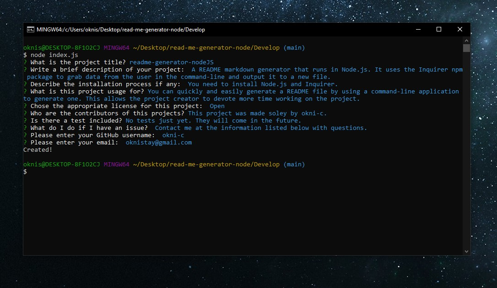

# readme-generator-nodeJS

## Description 
    
A README markdown generator that runs in Node.js. It uses the Inquirer npm package to grab data from the user in the command-line and output it to a new file.
    
## Table of Contents
    
* [Description](#description)
* [Installation](#installation)
* [Preview](#preview)
* [Usage](#usage)
* [License](#license)
* [Contributing](#contributing)
* [Tests](#tests)
* [Questions](#questions)
    
    
## Installation
    
You need to install Node.js and Inquirer.
    
## Preview 
    

## Usage

You can quickly and easily generate a README file by using a command-line application to generate one. This allows the project creator to devote more time working on the project. 
    
    
## License
    

    
    
## Contributing
    
This project was made soley by okni-c.

## Tests
    
No tests just yet. They will come in the future.

## Questions
Contact me at the information listed below with questions. 
 
Find me on GitHub: [okni-c](https://github.com/okni-c) 
 
Email me with any questions: oknistay@gmail.com  